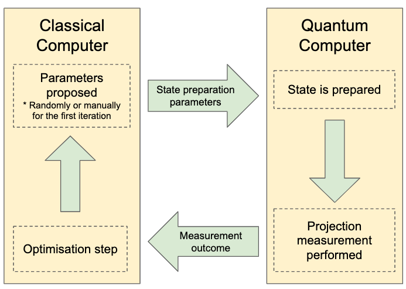

## 1.1 A bit of context

Okay, so there are a lot of places we could start from, the beginning of the universe being one of them. But let's save ourselves a good deal of time by picking a starting point.

- We're at the start of the [NISQ](https://arxiv.org/pdf/1801.00862.pdf) era. That stands for Noisy Intermediate-Scale Quantum, which is... pretty much what it is. We're at a place where:

  - we can build quantum devices with 50- several 100 qubits.
  - the qubits are still in quite noisy environments, meaning we can't run very long computations without the state of our system being spoiled.

- Currently there are a lot of reasons we'd want to know the ground state energy of a quantum system. Knowledge of the ground state helps us calculate/approximate a lot of other interesting properties. For instance, in quantum molecular chemistry we can use the ground state to calculate reaction rates, binding strengths or molecular pathways ([source](https://www.mustythoughts.com/variational-quantum-eigensolver-explained)).

- Classical computers have a very hard time at coming up with exact solutions for the aforementioned problem, the main reason being that the size of the quantum system's Hamiltonian scales exponentially with the number of qubits.

- There are quantum computing algorithms with proven speedups designed to solve related problems, but they still aren't feasible on today's NISQ devices.

## 1.2 So how does VQE fit in?

Right, so we're in a situation where we want to find the ground state energy of a quantum system, but for practical applications we can't do it with a classical computer, and a quantum computer which could solve the problem doesn't exist yet.

But what if we tried combining classical algorithms with short quantum computations (remember that noise prevents us from running long quantum computations)? Well, that's where VQE fits in.

## 1.3 A quick summary of what VQE does

VQE starts from the premise that we have a quantum system with a known Hamiltonian, and it gets an upper bound approximation for the ground state energy via an optimisation algorithm. The optimisation steps are calculated by the classical computer, whereas the evaluation of the objective function (i.e. the energy) is done by the quantum computer.

Let me just go through that again in a little more detail...

#### We have a quantum system with a known Hamiltonian

The Hamiltonian is an operator which, among other properties, has a matrix representation with eigenvalues equivalent to the various energies of the quantum system (_if that caught you off guard, I'd recommend you brush up on the [Hamiltonian](https://ocw.mit.edu/courses/nuclear-engineering/22-51-quantum-theory-of-radiation-interactions-fall-2012/lecture-notes/MIT22_51F12_Ch5.pdf)_).

Keep in mind that the size of a Hamiltonian's matrix representation scales with an _n_ qubit system as _2n_. It's pretty safe to say then that 50-100 qubit systems (like NISQ devices) are pretty much impossible to represent exactly on a classical computer.

_Pause... Do the back-of-the envelope calculation. A 50 qubit system has a Hamiltonian with 250 entries. If we were to matrix-multiply with the corresponding 250 long state vector that's 2100 multiplication operations (plus sums). An NVIDIA Tesla V100 GPU can get to around 1014 floating point operations (FLOPS) per second. Plug that all into your favorite calculator and you get that it would take several hundreds of thousands of years. You can do a similar exercise to figure out how many of your hardrive it would take to actually represent the Hamiltonian. Unpause..._

#### We want to get the ground state energy

The ground state is the lowest energy state of the quantum system and is the same as the lowest eigenvalue of Hamiltonian. Analytically, you would just eigendecompose the Hamiltonian matrix to get all the eigenvalues and associated eigenvectors. But as mentioned, this becomes impossible with 50~100+ qubit systems.

#### A quantum computer evaluates the objective function in our search space

Our "search space" is some subspace of all possible states of our quantum system, and the "objective function" is the energy associated with a given state. VQE makes use of a quantum system to actually measure the energy of a prepared state. Cool! So now we have a feasible way of actually computing an eigenvalue (**this is meant to be an Aha! moment by the way**).

#### We're getting an upper bound for the ground state energy

Because we're doing quantum measurements to get the ground state energy, we can only expect to get measurement outcomes at least as high as the ground state energy because... well that's what "ground state" is by defintion. And if we're working with a practical problem which is analytically intractable, we'll never truly know it even if we do get to the exact ground state. So that's why it's called an "upper bound".

#### We use a classical computer for performing the optimisation steps

Every time we prepare a state and make a measurement, we get a datapoint: state _|Ψ⟩_ has energy _E_. We can use classical optimisation algorithms to propose a next state to try based on the data we already have. Furthermore, that algorithm may be able to calculate some degree of certainty that we are near the real ground state.

You might find this diagram useful in summing up the process

Now head on to the tutorial notebook to dive into a VQE example! I would recommend
avoiding using Github's notebook viewer as it lacks full support for markdown equations.
You may:

1. Edit and run it on [Google Colab](https://colab.research.google.com/github/alexander-soare/framework-agnostic-vqe-tutorial/blob/master/02_Tutorial.ipynb)

   

2. [Preview it on Jupyter nbviewer](https://nbviewer.jupyter.org/github/alexander-soare/framework-agnostic-vqe-tutorial/blob/master/02_Tutorial.ipynb)
